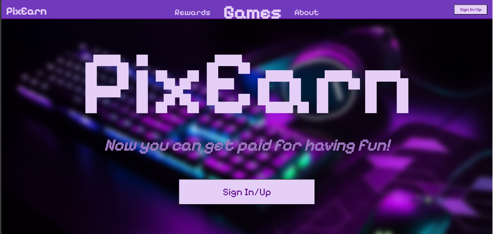
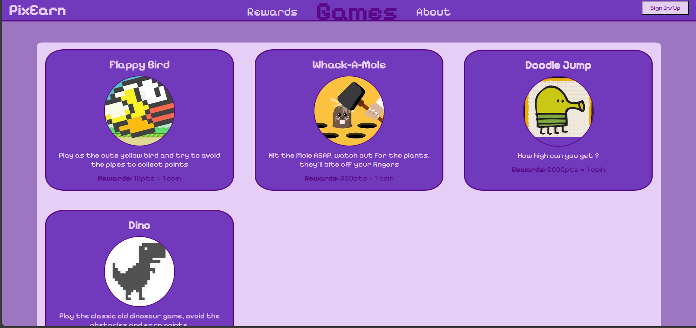

# Pixen

Pixen is a web platform where users can play JavaScript-based games to earn coins and spend them in an integrated shop. The website features sorting and filtering options for easier shopping and is designed to be mobile responsive.

## Features

- Play games to collect coins.
- Spend coins in the shop with advanced sorting and filtering.
- Mobile responsive design for optimal experience on all devices.

## Try It Out

Visit [Pixen]([https://hussienk.github.io/PixEarn/index.html]) to explore the website.

## Screenshots

### Homepage

### Shop Interface

### Game Play

